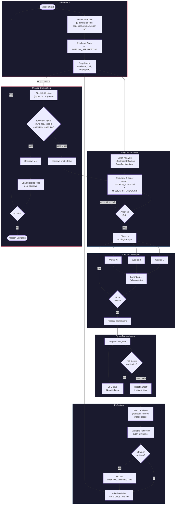

# autonomous-development

Autonomous dev daemon that continuously improves a codebase toward a "north star" objective. Spawns parallel Claude Code workers, manages state in SQLite, and learns from its own outcomes via an RL-style feedback loop.

Point it at a repo with an objective and a verification command. It plans, executes, merges, verifies, and pushes -- in a loop -- until the objective is met or it stalls. Then it auto-discovers the next objective and chains into a new mission.

## How it works



Each mission:
1. **Research** -- Three parallel agents (codebase analyst, domain researcher, prior art reviewer) investigate the problem space with MCP tool access. A synthesis agent combines findings into `MISSION_STRATEGY.md`
2. **Plan** -- Recursive planner reads `MISSION_STATE.md` and `MISSION_STRATEGY.md` from disk, decomposes the objective into work units with acceptance criteria, dependency ordering, and specialist assignments
3. **Ambition gate** -- Reject trivially scoped plans (configurable min score) and force replanning
4. **Layered execution** -- Work units execute in topological layers (parallel within layers, sequential across layers). Workers run as Claude Code subprocesses with MCP access
5. **Green branch merge** -- Completed units merge directly to `mc/green`. Optional pre-merge verification (pytest/ruff/mypy) gates the merge; failures trigger ZFC fixup agents
6. **Handoff ingestion** -- Workers emit structured `MC_RESULT` handoffs with files changed, concerns, discoveries. These feed the knowledge base and state tracking
7. **Batch analysis** -- Heuristic pattern detection: file hotspots (files touched by 3+ units), failure clusters, stalled areas (2+ failed attempts), effort distribution, knowledge gaps
8. **Strategic reflection** -- LLM synthesis of batch signals into patterns, tensions, and open questions. Can trigger strategy revision mid-mission
9. **State update** -- Fixed-size `MISSION_STATE.md` (progress counts, active issues, strategy summary, patterns, files modified) replaces the old growing log
10. **Evaluator agent** -- At mission end, a Claude subprocess with shell/file access runs the software, checks endpoints, and inspects output
11. **Strategize** -- Strategist proposes follow-up objectives; `--chain` auto-starts the next mission

## Quickstart

```bash
git clone git@github.com:dannywillowliu-uchi/autonomous-development.git
cd autonomous-development
make setup && make traces && make run
```

This installs dependencies (including tracing), starts Jaeger for trace collection, and launches a mission. Open http://localhost:16686 for the Jaeger UI and http://localhost:8080 for the live dashboard.

### Make targets

| Target | Description |
|--------|-------------|
| `make setup` | Create venv and install all deps (`uv sync --extra dev --extra tracing`) |
| `make test` | Run pytest and ruff |
| `make traces` | Start Jaeger (OTLP on :4317/:4318, UI on :16686) |
| `make dashboard` | Start live web dashboard on :8080 |
| `make run` | Run a mission with default config |
| `make clean` | Stop Docker containers |

### Manual setup

```bash
# Configure (edit to point at your repo)
cp mission-control.toml.example mission-control.toml
# Edit: target.path, target.objective, target.verification.command

# Run a mission
.venv/bin/python -m mission_control.cli mission --config mission-control.toml --workers 2

# Run with auto-chaining (continues after objective is met)
.venv/bin/python -m mission_control.cli mission --config mission-control.toml --workers 2 --chain

# Live web dashboard
.venv/bin/python -m mission_control.cli live --config mission-control.toml --port 8080
```

## Configuration

All config lives in `mission-control.toml`:

```toml
[target]
name = "my-project"
path = "/path/to/repo"
branch = "main"
objective = "Add comprehensive test coverage for the auth module"

[target.verification]
command = "pytest -q && ruff check src/"
timeout = 120

[scheduler]
model = "opus"           # Model for all Claude subprocesses
session_timeout = 900    # Max seconds per worker session

[scheduler.budget]
max_per_session_usd = 5.0
max_per_run_usd = 100.0

[scheduler.parallel]
num_workers = 2          # Parallel Claude workers
pool_dir = "/tmp/mc-pool"

[rounds]
max_rounds = 20          # Max rounds before stopping
stall_threshold = 5      # Rounds with no improvement before stopping

[planner]
max_depth = 2            # Recursive decomposition depth
max_children_per_node = 5

[continuous]
max_wall_time_seconds = 3600
min_ambition_score = 4          # Reject trivial plans (1-10 scale)
max_replan_attempts = 2         # Replan attempts on ambition rejection
verify_objective_completion = true  # LLM verifies objective before declaring done
max_objective_checks = 2

[continuous]
verify_before_merge = true   # Pre-merge verification gate (default: on)

[review]
gate_completion = true       # Block low-quality units
min_review_score = 5.0       # Minimum average review score (1-10)
model = "haiku"              # Cheaper model for diff review
skip_when_criteria_passed = true  # Skip review when acceptance criteria passed

[evaluator]
enabled = false              # Opt-in: evaluator agent at mission end
model = "sonnet"             # Model for evaluator subprocess
budget_usd = 0.50            # Max cost per evaluation
timeout = 300                # Seconds before timeout
max_turns = 10               # Max agentic turns

[green_branch]
auto_push = true         # Push mc/green to main after each round
push_branch = "main"
fixup_max_attempts = 3
# fixup_candidates = 3   # N-of-M parallel fixup agents

[discovery]
enabled = true
tracks = ["feature", "quality", "security"]
research_enabled = true

[mcp]
config_path = "~/.claude/settings.local.json"  # MCP JSON config file
enabled = true                                  # Pass --mcp-config to all subprocesses

[research]
enabled = true               # Pre-planning research phase
budget_per_agent_usd = 1.0   # Budget per research agent
timeout = 300                # Seconds per research agent
model = ""                   # Defaults to scheduler.model

[models]
planner = "opus"         # Model for planning calls
reviewer = "sonnet"      # Model for diff review
strategist = "opus"      # Model for objective proposal

[hitl]
enabled = false
gates = ["push", "large_merge"]  # Actions requiring approval
poll_timeout = 300               # Seconds to wait for approval
telegram = true                  # Use Telegram for approval prompts

[speculation]
enabled = false
branch_count = 3         # Parallel branches per uncertain unit
selection = "best_score" # How to pick the winner

[degradation]
enabled = true
failure_threshold = 5    # Failures before circuit opens
reset_timeout = 300      # Seconds before half-open retry
fallback_strategy = "simple"

[episodic_memory]
enabled = true
max_episodes = 100       # Max stored episodes per project
similarity_threshold = 0.7

[a2a]
enabled = false
host = "0.0.0.0"
port = 5000

[tracing]
enabled = false
otlp_endpoint = "http://localhost:4317"  # OTLP gRPC (Jaeger via docker-compose)
service_name = "mission-control"
```

## Architecture

```
src/mission_control/
+-- cli.py                   # CLI entry point
+-- config.py                # TOML config loader, build_claude_cmd(), MCPConfig
+-- models.py                # Dataclasses (Mission, WorkUnit, Epoch, ...)
+-- db.py                    # SQLite with WAL mode + migrations
+-- # Core loop
+-- continuous_controller.py # Main loop: research -> plan -> execute -> reflect
+-- continuous_planner.py    # Adaptive planner wrapper around RecursivePlanner
+-- recursive_planner.py     # LLM-based tree decomposition with PLAN_RESULT marker
+-- research_phase.py        # Pre-planning parallel research + synthesis -> MISSION_STRATEGY.md
+-- batch_analyzer.py        # Heuristic pattern detection (hotspots, failures, stalled areas)
+-- strategic_reflection.py  # LLM synthesis of batch signals -> patterns, tensions, revision
+-- planner_context.py       # Minimal planner context + fixed-size MISSION_STATE.md writer
+-- # Workers
+-- worker.py                # Worker prompt rendering + handoff parsing
+-- specialist.py            # Specialist worker template routing
+-- feedback.py              # Worker context from past experiences
+-- overlap.py               # File overlap detection + dependency injection
+-- # Merge pipeline
+-- green_branch.py          # mc/green branch lifecycle, merge, ZFC fixup
+-- # Quality + review
+-- diff_reviewer.py         # Fire-and-forget LLM diff review (scoring, no gating)
+-- evaluator.py             # Round scoring (test/lint delta, completion, regression)
+-- grading.py               # Deterministic decomposition grading
+-- # Strategy + discovery
+-- strategist.py            # Mission objective proposal, ambition scoring
+-- auto_discovery.py        # Gap analysis -> research -> backlog pipeline
+-- priority.py              # Backlog priority scoring + recalculation
+-- backlog_manager.py       # Persistent backlog across missions
+-- # Infrastructure
+-- session.py               # Claude subprocess spawning + output parsing
+-- heartbeat.py             # Time-based progress monitor + Telegram alerts
+-- notifier.py              # Telegram notifications (mission events, conflicts)
+-- hitl.py                  # Human-in-the-loop approval gates (file + Telegram)
+-- degradation.py           # Graceful degradation with circuit breakers
+-- circuit_breaker.py       # Circuit breaker state machine
+-- ema.py                   # Exponential moving average budget tracking
+-- memory.py                # Typed context store for workers
+-- # External interfaces
+-- mcp_server.py            # MCP server for external control
+-- a2a.py                   # Agent-to-Agent protocol server
+-- dashboard/
|   +-- live.py              # FastAPI + HTMX web dashboard
|   +-- tui.py               # Terminal UI
+-- backends/
|   +-- local.py             # Local subprocess backend with workspace pool
|   +-- ssh.py               # Remote SSH backend
```

## Key concepts

**Research phase**: Before the first planning iteration, three parallel agents (codebase analyst, domain researcher, prior art reviewer) investigate the problem with MCP tool access (web search, library docs). A synthesis agent combines findings into `MISSION_STRATEGY.md`, which the planner reads from disk. Knowledge items are stored in the DB for cross-mission learning.

**Batch analysis**: After each batch of work units completes, heuristic pattern detection runs on the DB: file hotspots (files touched by 3+ units), failure clusters (recurring error patterns), stalled areas (2+ failed attempts with no success), effort distribution, retry depth, and knowledge gaps (areas where implementation outpaces research coverage).

**Strategic reflection**: An LLM synthesizes batch signals into actionable patterns, tensions between strategy and reality, and open questions. When tensions are severe enough, it can trigger a mid-mission strategy revision that rewrites `MISSION_STRATEGY.md`.

**Fixed-size MISSION_STATE.md**: Progress summary that stays constant size regardless of mission length. Contains progress counts, active issues (last 3 failures), strategy summary, patterns from reflection, and files modified grouped by directory. Replaces the old growing log that bloated planner context.

**MCP access**: All Claude subprocesses (workers, planner, reviewer, strategist, research agents) receive `--mcp-config` when configured, giving them access to external tools (web search, library docs via context7, etc.). Controlled by `[mcp]` in TOML config.

**Green branch pattern**: Workers merge directly to `mc/green`. Optional pre-merge verification (pytest/ruff/mypy) gates the merge; failures trigger ZFC fixup agents that run in parallel and select the best candidate.

**Ambition gate**: The controller scores planned work units on ambition (1-10). Plans below the threshold are rejected and the planner is forced to replan, preventing trivially scoped busywork.

**Evaluator agent**: At mission end, a Claude subprocess with full tool access (shell, file reads) actually runs the software: executes tests, checks HTTP endpoints, inspects files. Disabled by default.

**Graceful degradation**: Circuit breakers track failure rates per component. When tripped, the system falls back to simpler strategies instead of failing outright.

**Human-in-the-loop (HITL)**: Configurable approval gates before push/merge operations. Supports file-based polling and Telegram-based approval prompts.

**Adaptive planning**: The recursive planner decomposes objectives into a tree of work units with acceptance criteria and dependencies. File overlap detection automatically adds dependency edges. The planner reads `MISSION_STATE.md` and `MISSION_STRATEGY.md` from disk rather than receiving bloated context strings.

**Mission chaining**: With `--chain`, after a mission completes, the strategist proposes the next objective and a new mission starts automatically.

**Live dashboard**: Real-time web dashboard (FastAPI + HTMX) showing mission state, worker status, merge activity, and cost tracking via Server-Sent Events.

## CLI commands

```bash
# Run a mission
mc mission --config mission-control.toml --workers 2 [--chain]

# Show current status
mc status --config mission-control.toml

# Show session history
mc history --config mission-control.toml

# Auto-discover improvements
mc discover --config mission-control.toml

# Initialize a mission-control config
mc init --config mission-control.toml

# Live web dashboard
mc live --config mission-control.toml --port 8080

# TUI dashboard
mc dashboard --config mission-control.toml

# View mission summary
mc summary --config mission-control.toml

# Multi-project registry
mc register --config mission-control.toml
mc unregister --config mission-control.toml
mc projects

# Start MCP server (stdio)
mc mcp --config mission-control.toml

# Start A2A protocol server
mc a2a --config mission-control.toml

# Validate config file
mc validate-config --config mission-control.toml

# Manage backlog priority queue
mc priority list --config mission-control.toml
mc priority set <item-id> <score>
mc priority defer <item-id>
mc priority import --file BACKLOG.md
mc priority recalc
mc priority export
```

## Tests

```bash
uv run pytest -q                           # 1,460+ tests
uv run ruff check src/ tests/              # Lint
uv run mypy src/mission_control --ignore-missing-imports  # Types
```

## Requirements

- Python 3.11+
- [Claude Code CLI](https://docs.anthropic.com/en/docs/claude-code) (`claude` command available)
- Claude Max or API key with sufficient budget
- Git
