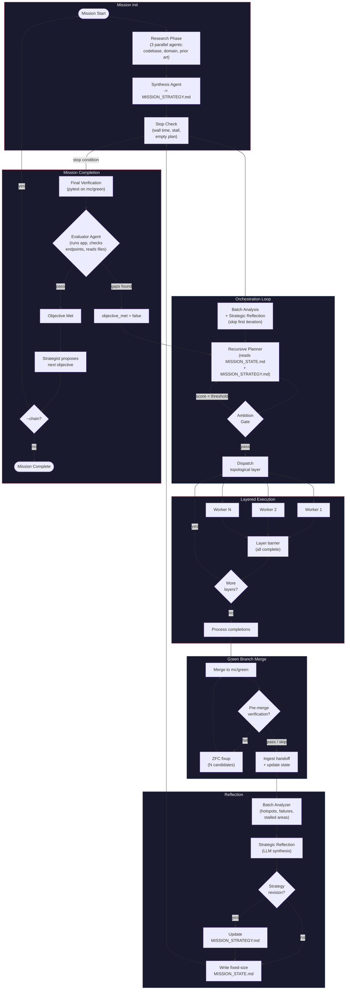

# autonomous-development

Autonomous dev daemon that continuously improves a codebase toward a "north star" objective. Spawns parallel Claude Code workers, manages state in SQLite, and learns from its own outcomes via an RL-style feedback loop.

Point it at a repo with an objective and a verification command. It plans, executes, merges, verifies, and pushes -- in a loop -- until the objective is met or it stalls. Then it auto-discovers the next objective and chains into a new mission.

## How it works


```mermaid
flowchart TD
    subgraph Init["Mission Init"]
        direction TB
        Start([Mission Start]) --> Research
        Research["Research Phase\n(3 parallel agents:\ncodebase, domain, prior art)"]
        Research --> Synth["Synthesis Agent\n-> MISSION_STRATEGY.md"]
        Synth --> Loop
    end

    subgraph Controller["Orchestration Loop"]
        direction TB
        Loop["Stop Check\n(wall time, stall,\nempty plan)"]
        Loop --> Reflect
        Reflect["Batch Analysis\n+ Strategic Reflection\n(skip first iteration)"]
        Reflect --> Plan
        Plan["Recursive Planner\n(reads MISSION_STATE.md\n+ MISSION_STRATEGY.md)"]
        Plan --> Ambition{"Ambition\nGate"}
        Ambition -- "score < threshold" --> Plan
        Ambition -- "pass" --> Dispatch
    end

    subgraph Execution["Layered Execution"]
        direction TB
        Dispatch["Dispatch\ntopological layer"] --> W1["Worker 1"]
        Dispatch --> W2["Worker 2"]
        Dispatch --> W3["Worker N"]
        W1 & W2 & W3 --> Barrier["Layer barrier\n(all complete)"]
        Barrier --> NextLayer{"More\nlayers?"}
        NextLayer -- "yes" --> Dispatch
        NextLayer -- "no" --> Process
    end

    subgraph Merge["Green Branch Merge"]
        direction TB
        Process["Process completions"] --> GitMerge["Merge to mc/green"]
        GitMerge --> PreMerge{"Pre-merge\nverification?"}
        PreMerge -- "fail" --> Fixup["ZFC fixup\n(N candidates)"]
        Fixup --> GitMerge
        PreMerge -- "pass / skip" --> Ingest["Ingest handoff\n+ update state"]
    end

    subgraph Analysis["Reflection"]
        direction TB
        Ingest --> BA["Batch Analyzer\n(hotspots, failures,\nstalled areas)"]
        BA --> SR["Strategic Reflection\n(LLM synthesis)"]
        SR --> RevQ{"Strategy\nrevision?"}
        RevQ -- "yes" --> Update["Update\nMISSION_STRATEGY.md"]
        RevQ -- "no" --> State["Write fixed-size\nMISSION_STATE.md"]
        Update --> State
    end

    State --> Loop

    subgraph Completion["Mission Completion"]
        direction TB
        FinalVerify["Final Verification\n(pytest on mc/green)"]
        FinalVerify --> Evaluator{"Evaluator Agent\n(runs app, checks\nendpoints, reads files)"}
        Evaluator -- "gaps found" --> ObjFail["objective_met = false"]
        Evaluator -- "pass" --> ObjMet["Objective Met"]
        ObjMet --> Strategist["Strategist proposes\nnext objective"]
        Strategist --> Chain{"--chain?"}
        Chain -- "yes" --> Start
        Chain -- "no" --> Done([Mission Complete])
        ObjFail --> Plan
    end

    Loop -- "stop condition" --> FinalVerify

    style Init fill:#1a1a2e,stroke:#e94560,color:#eee
    style Controller fill:#1a1a2e,stroke:#0f3460,color:#eee
    style Execution fill:#1a1a2e,stroke:#e94560,color:#eee
    style Merge fill:#1a1a2e,stroke:#16213e,color:#eee
    style Analysis fill:#1a1a2e,stroke:#0f3460,color:#eee
    style Completion fill:#1a1a2e,stroke:#e94560,color:#eee
```

Each mission:
1. **Research** -- Three parallel agents (codebase analyst, domain researcher, prior art reviewer) investigate the problem space with MCP tool access. A synthesis agent combines findings into `MISSION_STRATEGY.md`
2. **Plan** -- Recursive planner reads `MISSION_STATE.md` and `MISSION_STRATEGY.md` from disk, decomposes the objective into work units with acceptance criteria, dependency ordering, and specialist assignments
3. **Ambition gate** -- Reject trivially scoped plans (configurable min score) and force replanning
4. **Layered execution** -- Work units execute in topological layers (parallel within layers, sequential across layers). Workers run as Claude Code subprocesses with MCP access
5. **Green branch merge** -- Completed units merge directly to `mc/green`. Optional pre-merge verification (pytest/ruff/mypy) gates the merge; failures trigger ZFC fixup agents
6. **Handoff ingestion** -- Workers emit structured `MC_RESULT` handoffs with files changed, concerns, discoveries. These feed the knowledge base and state tracking
7. **Batch analysis** -- Heuristic pattern detection: file hotspots (files touched by 3+ units), failure clusters, stalled areas (2+ failed attempts), effort distribution, knowledge gaps
8. **Strategic reflection** -- LLM synthesis of batch signals into patterns, tensions, and open questions. Can trigger strategy revision mid-mission
9. **State update** -- Fixed-size `MISSION_STATE.md` (progress counts, active issues, strategy summary, patterns, files modified) replaces the old growing log
10. **Evaluator agent** -- At mission end, a Claude subprocess with shell/file access runs the software, checks endpoints, and inspects output
11. **Strategize** -- Strategist proposes follow-up objectives; `--chain` auto-starts the next mission

## Installation

```bash
pip install autonomous-dev
```

With optional extras:

```bash
pip install autonomous-dev[mcp]                  # MCP server for Claude Code
pip install autonomous-dev[dashboard]             # Live web + TUI dashboards
pip install autonomous-dev[mcp,dashboard,tracing] # Everything
```

Or install from source:

```bash
git clone git@github.com:dannywillowliu-uchi/autonomous-development.git
cd autonomous-development
uv sync --extra dev
```

## Quickstart

```bash
# Copy and edit the example config to point at your project
cp mission-control.toml.example mission-control.toml
# Edit: target.path, target.objective, target.verification.command

# Launch a mission
mc mission --config mission-control.toml
```

If running from source, use `uv run mc` instead of `mc`.

That's it. mission-control will plan, dispatch parallel workers, merge results, and loop until the objective is met or it stalls.

### Prerequisites

- Python 3.11+
- [uv](https://docs.astral.sh/uv/) (Python package manager)
- [Claude Code CLI](https://docs.anthropic.com/en/docs/claude-code) (`claude` command available in PATH)
- Claude Max subscription or API key with sufficient budget
- Git

### Make targets

| Target | Description |
|--------|-------------|
| `make setup` | Create venv and install all deps (`uv sync --extra dev --extra tracing`) |
| `make test` | Run pytest and ruff |
| `make traces` | Start Jaeger (OTLP on :4317/:4318, UI on :16686) |
| `make dashboard` | Start live web dashboard on :8080 |
| `make run` | Run a mission with default config |
| `make clean` | Stop Docker containers |

### CLI commands

```bash
# Run a mission
uv run mc mission --config mission-control.toml

# Run with more workers
uv run mc mission --config mission-control.toml --workers 4

# Run with auto-chaining (continues after objective is met)
uv run mc mission --config mission-control.toml --chain

# Live web dashboard
uv run mc live --config mission-control.toml --port 8080

# Show current status
uv run mc status --config mission-control.toml

# TUI dashboard
uv run mc dashboard --config mission-control.toml
```

## Configuration

Copy the example config and edit it for your project:

```bash
cp mission-control.toml.example mission-control.toml
```

The three fields you must change:

```toml
[target]
name = "my-project"
path = "/absolute/path/to/your/repo"     # Must be absolute
objective = """What you want built or improved.
Be specific about the end state and success criteria."""

[target.verification]
command = "pytest -q && ruff check src/"   # Must exit 0 when healthy
```

See [`mission-control.toml.example`](mission-control.toml.example) for the full annotated config with all options. Key sections:

| Section | What it controls |
|---------|-----------------|
| `[target]` | Repo path, branch, objective, verification command |
| `[scheduler]` | Model choice, worker count, budget limits, session timeout |
| `[planner]` | Decomposition depth, max units per round, deliberation |
| `[continuous]` | Wall time limit, ambition gate, pre-merge verification |
| `[green_branch]` | Working/green branch names, auto-push, fixup retries |
| `[rounds]` | Max planning rounds, stall detection threshold |
| `[research]` | Pre-planning research phase (3 parallel agents) |
| `[evaluator]` | End-of-mission evaluator agent (opt-in) |
| `[mcp]` | MCP tool access for all subprocesses |
| `[hitl]` | Human-in-the-loop approval gates |
| `[core_tests]` | Per-epoch correctness test suite (opt-in, project-defined runner) |
| `[discovery]` | Auto-discover next objective after completion |

## Architecture

```
src/mission_control/
+-- cli.py                   # CLI entry point
+-- config.py                # TOML config loader, build_claude_cmd(), MCPConfig
+-- models.py                # Dataclasses (Mission, WorkUnit, Epoch, ...)
+-- db.py                    # SQLite with WAL mode + migrations
+-- # Core loop
+-- continuous_controller.py # Main loop: research -> plan -> execute -> reflect
+-- continuous_planner.py    # Adaptive planner wrapper around RecursivePlanner
+-- recursive_planner.py     # LLM-based tree decomposition with PLAN_RESULT marker
+-- research_phase.py        # Pre-planning parallel research + synthesis -> MISSION_STRATEGY.md
+-- batch_analyzer.py        # Heuristic pattern detection (hotspots, failures, stalled areas)
+-- strategic_reflection.py  # LLM synthesis of batch signals -> patterns, tensions, revision
+-- planner_context.py       # Minimal planner context + fixed-size MISSION_STATE.md writer
+-- core_tests.py            # Per-epoch core test runner integration + experience storage
+-- # Workers
+-- worker.py                # Worker prompt rendering + handoff parsing
+-- specialist.py            # Specialist worker template routing
+-- feedback.py              # Worker context from past experiences
+-- overlap.py               # File overlap detection + dependency injection
+-- # Merge pipeline
+-- green_branch.py          # mc/green branch lifecycle, merge, ZFC fixup
+-- # Quality + review
+-- diff_reviewer.py         # Fire-and-forget LLM diff review (scoring, no gating)
+-- evaluator.py             # Round scoring (test/lint delta, completion, regression)
+-- grading.py               # Deterministic decomposition grading
+-- # Strategy + discovery
+-- strategist.py            # Mission objective proposal, ambition scoring
+-- auto_discovery.py        # Gap analysis -> research -> backlog pipeline
+-- priority.py              # Backlog priority scoring + recalculation
+-- backlog_manager.py       # Persistent backlog across missions
+-- # Infrastructure
+-- session.py               # Claude subprocess spawning + output parsing
+-- heartbeat.py             # Time-based progress monitor + Telegram alerts
+-- notifier.py              # Telegram notifications (mission events, conflicts)
+-- hitl.py                  # Human-in-the-loop approval gates (file + Telegram)
+-- degradation.py           # Graceful degradation with circuit breakers
+-- circuit_breaker.py       # Circuit breaker state machine
+-- ema.py                   # Exponential moving average budget tracking
+-- memory.py                # Typed context store for workers
+-- # External interfaces
+-- mcp_server.py            # MCP server for external control
+-- a2a.py                   # Agent-to-Agent protocol server
+-- dashboard/
|   +-- live.py              # FastAPI + HTMX web dashboard
|   +-- tui.py               # Terminal UI
+-- backends/
|   +-- local.py             # Local subprocess backend with workspace pool
|   +-- ssh.py               # Remote SSH backend
```

## Key concepts

**Research phase**: Before the first planning iteration, three parallel agents (codebase analyst, domain researcher, prior art reviewer) investigate the problem with MCP tool access (web search, library docs). A synthesis agent combines findings into `MISSION_STRATEGY.md`, which the planner reads from disk. Knowledge items are stored in the DB for cross-mission learning.

**Batch analysis**: After each batch of work units completes, heuristic pattern detection runs on the DB: file hotspots (files touched by 3+ units), failure clusters (recurring error patterns), stalled areas (2+ failed attempts with no success), effort distribution, retry depth, and knowledge gaps (areas where implementation outpaces research coverage).

**Strategic reflection**: An LLM synthesizes batch signals into actionable patterns, tensions between strategy and reality, and open questions. When tensions are severe enough, it can trigger a mid-mission strategy revision that rewrites `MISSION_STRATEGY.md`.

**Fixed-size MISSION_STATE.md**: Progress summary that stays constant size regardless of mission length. Contains progress counts, active issues (last 3 failures), strategy summary, patterns from reflection, and files modified grouped by directory. Replaces the old growing log that bloated planner context.

**MCP access**: All Claude subprocesses (workers, planner, reviewer, strategist, research agents) receive `--mcp-config` when configured, giving them access to external tools (web search, library docs via context7, etc.). Controlled by `[mcp]` in TOML config.

**Green branch pattern**: Workers merge directly to `mc/green`. Optional pre-merge verification (pytest/ruff/mypy) gates the merge; failures trigger ZFC fixup agents that run in parallel and select the best candidate.

**Ambition gate**: The controller scores planned work units on ambition (1-10). Plans below the threshold are rejected and the planner is forced to replan, preventing trivially scoped busywork.

**Evaluator agent**: At mission end, a Claude subprocess with full tool access (shell, file reads) actually runs the software: executes tests, checks HTTP endpoints, inspects files. Disabled by default.

**Graceful degradation**: Circuit breakers track failure rates per component. When tripped, the system falls back to simpler strategies instead of failing outright.

**Human-in-the-loop (HITL)**: Configurable approval gates before push/merge operations. Supports file-based polling and Telegram-based approval prompts.

**Adaptive planning**: The recursive planner decomposes objectives into a tree of work units with acceptance criteria and dependencies. File overlap detection automatically adds dependency edges. The planner reads `MISSION_STATE.md` and `MISSION_STRATEGY.md` from disk rather than receiving bloated context strings.

**Core test feedback loop**: An optional per-epoch correctness signal. When `[core_tests]` is enabled, the controller runs a project-defined test command after each epoch and feeds pass/fail/regression data back to the planner via `MISSION_STATE.md` and the feedback context. Results persist across missions as experiences, so the planner learns which kinds of work improve (or regress) correctness. The runner must produce a standardized `results.json` (see `core_tests.py` for the schema). Any project can plug in its own runner -- the framework is agnostic to what the tests actually do.

**Mission chaining**: With `--chain`, after a mission completes, the strategist proposes the next objective and a new mission starts automatically.

**Live dashboard**: Real-time web dashboard (FastAPI + HTMX) showing mission state, worker status, merge activity, and cost tracking via Server-Sent Events.

## Setting up a new project

To point mission-control at any repo:

1. **Create a config file** in the target repo (or anywhere):
   ```bash
   cp /path/to/autonomous-development/mission-control.toml.example my-project/mission-control.toml
   ```

2. **Edit the three required fields**:
   ```toml
   [target]
   name = "my-project"
   path = "/absolute/path/to/my-project"
   objective = """Build a REST API with user auth, CRUD endpoints, and tests."""

   [target.verification]
   command = "pytest -q && ruff check src/"
   setup_command = "uv sync --extra dev"       # runs once before first worker
   ```

3. **Optionally add a core test suite** for per-epoch correctness feedback:
   ```toml
   [core_tests]
   enabled = true
   runner_command = "python tests/core/runner.py"   # any shell command
   baseline_path = "tests/core/baseline.json"       # for delta tracking
   ```
   The runner must produce a `results.json` with `summary` (total/passed/failed/skipped), `tests` (per-test status), and `deltas` (newly passing/failing). See `core_tests.py` for the full schema.

4. **Launch**:
   ```bash
   cd /path/to/autonomous-development
   uv run mc mission --config /path/to/my-project/mission-control.toml
   ```

### Tips for writing good objectives

- Be specific about the end state, not the steps to get there
- Include language/framework constraints: "in Python using FastAPI"
- Include success criteria: "all tests pass, ruff clean, 80%+ coverage"
- The planner decomposes objectives into parallel units — broad objectives work well

### For AI agents setting up missions

If you're an AI agent configuring mission-control for a user:

1. Copy `mission-control.toml.example` to the target project
2. Set `target.path` to the absolute path of the target repo
3. Set `target.branch` to the repo's default branch
4. Write the `target.objective` based on user intent — be specific and include constraints
5. Set `target.verification.command` to the project's test/lint command (must exit 0 when healthy)
6. Set `target.verification.setup_command` to install dependencies (e.g., `uv sync --extra dev`, `npm install`)
7. Adjust `scheduler.parallel.num_workers` based on task complexity (2-4 workers typical)
8. Launch: `cd <autonomous-development-dir> && uv run mc mission --config <path-to-config>`

The config file can live anywhere — pass its path with `--config`.

## All CLI commands

> **Note:** If installed via pip, use `mc` directly. If running from source, use `uv run mc`.

```bash
# Core
mc mission --config mission-control.toml [--workers N] [--chain]
mc status --config mission-control.toml
mc summary --config mission-control.toml
mc history --config mission-control.toml

# Dashboards
mc live --config mission-control.toml --port 8080
mc dashboard --config mission-control.toml

# Discovery and planning
mc discover --config mission-control.toml
mc init --config mission-control.toml
mc validate-config --config mission-control.toml

# Backlog management
mc priority list --config mission-control.toml
mc priority set <item-id> <score>
mc priority import --file BACKLOG.md
mc priority recalc

# Multi-project
mc register --config mission-control.toml
mc unregister --config mission-control.toml
mc projects

# External interfaces
mc mcp --config mission-control.toml     # MCP server (stdio)
mc a2a --config mission-control.toml     # Agent-to-Agent protocol
```

## MCP Server Setup

The MCP server lets Claude Code (or any MCP client) control missions directly from chat.

Install with the MCP extra:

```bash
pip install autonomous-dev[mcp]
```

Add to your Claude Code MCP config (`~/.claude.json` or project `.mcp.json`):

```json
{
  "mcpServers": {
    "mission-control": {
      "command": "mc",
      "args": ["mcp", "--config", "/absolute/path/to/mission-control.toml"]
    }
  }
}
```

If running from source, use `uv run mc` as the command.

### Available MCP Tools

| Tool | Description |
|------|-------------|
| `list_projects` | List all registered projects and their status |
| `get_project_status` | Get detailed status for a project (progress, workers, cost) |
| `launch_mission` | Start a mission with objective and config |
| `stop_mission` | Gracefully stop a running mission |
| `retry_unit` | Retry a failed work unit |
| `adjust_mission` | Adjust worker count or budget mid-mission |
| `register_project` | Register a new project with config path |
| `get_round_details` | Get details for a specific planning round |
| `web_research` | Search the web (DuckDuckGo, PyPI, GitHub, URL fetch) |

### Example prompts in Claude Code

- "Register my project and start a mission to add authentication"
- "How's the mission going? Show me the status"
- "Retry the failed unit for the login endpoint"
- "Stop the current mission"

## Tests

```bash
uv run pytest -q                           # 2,100+ tests
uv run ruff check src/ tests/              # Lint
uv run mypy src/mission_control --ignore-missing-imports  # Types
```

## Example: C compiler built from scratch

We used mission-control to build a [C compiler](https://github.com/dannywillowliu-uchi/C_compiler_orchestrated) from an empty repo — 8,100 lines of compiler code, 1,788 tests passing, zero human-written code. 4 parallel workers, ~5 hours wall time, ~$55 API cost.
